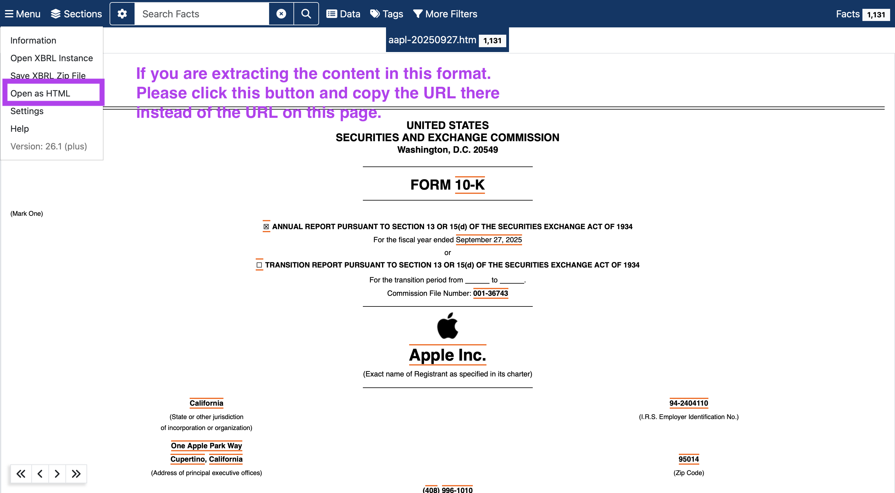

# vici-task2

This document contains the original task statement and defines the overall requirements for extracting Item-level content from SEC Form 10-K filings.

## 題目二：SEC 10-K 財報 Item-level 結構化抽取

美國上市公司每年向 SEC 提交的 10-K 年度報告有規範的結構（Part I–IV 底下的 Item 1–16），但實際檔案格式變異極大。

請做一個 pipeline：從原始的 10-K filing 抽取出各個 item，讓它們能被獨立取用。請自建 evaluation set 驗證系統的可靠性，並提供網站前端，讓我們可以提交或選擇 filings、檢視抽取出的 items，並理解抽取信心或失敗案例。我們會用自己挑的 filings 驗證。

請在 README 或前端中清楚列出：

- 你認為目前抽取得好的 filings 或公司，並提供例子
- 目前仍有困難、不穩定，或尚未支援的 filings 或公司，並提供具體失敗案例

**我們會看**：在格式變異下如何保持穩健、在沒有公開 ground truth 的情況下如何驗證自己、edge case 的處理、成本紀律，以及你對效能、擴充性與正確性驗證的分析。

---

## 輸入格式

前端與後端 API 目前只接受一種輸入：一個直接指向 SEC EDGAR 文件本身的 URL（不支援 CIK、accession number、ticker 或檔案上傳）。

驗證規則（見 `backend/app/repositories/sec_filing_repository.py` 的 `validate_url`）：

- 網域必須是 `https://www.sec.gov`；轉址後的最終網址也會重新驗證一次，避免透過 redirect 繞過限制。
- 網址必須以 `/Archives/edgar/data/` 開頭，並直接指向文件本身（`.htm` / `.html` / `.txt` 結尾）——不能是 filing 的 index/landing page。

支援的文件型別：

- HTML 10-K 文件（單一 primary document）。
- SEC complete-submission TXT 檔（整份 filing 的純文字版本，內含 `10-K`／`10-K405`／`10-KSB`／`10KSB` 文件）。

範例：

| 格式 | 公司／年份 | URL |
|---|---|---|
| htm（較新格式） | Coca-Cola, 2025 10-K | `https://www.sec.gov/Archives/edgar/data/21344/000162828026010047/ko-20251231.htm` |
| txt（較舊格式） | Coca-Cola, 1994 10-K | `https://www.sec.gov/Archives/edgar/data/21344/0000021344-95-000007.txt` |

---

## 系統設計與評估

以下對應上方「我們會看」的每一項，並附上實際跑過的資料佐證。完整結果在 `backend/tests/layer1_confidence_survey.csv`（50 筆真實 SEC 10-K filings，涵蓋大型企業與小型/利基產業公司、1994–2026、TXT 與 HTML 兩種格式）。

### 目前抽取得好的 filings（範例）

Layer 1（純 regex + lxml，無 LLM）在 50 筆中有 44 筆（88%）confidence ≥ 0.90：

| 公司 | 年份 | 格式 | Confidence |
|---|---|---|---|
| Guitron International Inc | 2003 | html (10KSB) | 0.964 |
| Exxon Mobil Corp | 2026 | html | 0.960 |
| 6D Global Technologies, Inc | 2016 | html | 0.960 |
| American Lawyer Media Holdings Inc | 2004 | html | 0.959 |
| Bayou Steel Corp | 1994 | txt | 0.958 |

這些案例的共同點：Item heading 是獨立、格式一致的區塊（純文字行或獨立的 `
`/`<b>`），沒有頁首重複、沒有 TOC 與內文混淆的問題。

### 目前仍有困難的 filings（具體失敗案例）

50 筆中有 6 筆低於 0.90 threshold：

| 公司 | 年份 | Confidence | 根本原因（已實際除錯確認） |
|---|---|---|---|
| General Electric Co | 2026 | **0.737** | 每個 Item 的 title 都被解析成空字串——GE 這份 filing 把 Item 編號與標題文字拆在不同的 DOM 節點，導致 `title_similarity` 全部掉到 0，`body_vs_toc` 也因此偏低 |
| Amazon.com Inc | 2026 | 0.871 | 尚未逐項除錯；初步觀察與大型公司常見的重複頁首/交叉引用有關 |
| Bayou Steel Corp | 2004 | 0.875 | 同一間公司 1994 年 TXT 版本反而拿到 0.958——換成 HTML 格式後分數不升反降，值得後續追查 |
| Meta Platforms, Inc. | 2013 | 0.884 | 早期（2013）filing 格式與現在的 iXBRL 版本落差大 |
| Berkshire Hathaway Inc | 2026 | 0.894 | 剛好卡在 threshold 邊界 |
| General Electric Co | 1994 | 0.897 | 同上，GE 從 1994 到 2026 兩個年份都偏低 |

另外已知但這次調查沒有涵蓋的限制：非 10-K 表格（如外國私人發行人常用的 20-F、10-Q）、完全沒有標準 Item 結構的極早期 filing、非英文 filing，目前都不支援。

### 在格式變異下如何保持穩健

- **統一的中介表示法**：HTML（`lxml` DOM 走訪）與 TXT（SGML 標籤剝除 + 逐行）各自獨立 normalize，但都收斂成同一個 `NormalizedDocument`（text + blocks + rich_blocks）。下游的 heading 偵測、信心評分、內容切片完全不需要知道原始格式是什麼。
- **分層 fallback**：Layer 1（規則式，免費、毫秒級）→ Layer 2（小模型 Haiku 4.5，整份文件重新判斷 Item 邊界）→ Layer 3（強模型 Sonnet 5，同一套機制換模型）。當規則式方法在異常格式上失準時，交給真正理解文件語意的模型處理，而不是持續堆規則。
- **實證**：這次調查刻意涵蓋 1994 年 SGML 時代的純文字 filing 到 2026 年 iXBRL 密集的 HTML，橫跨 10 個產業、大型與微型公司都有，Layer 1 單獨就能在 88% 的案例達標。

### 在沒有公開 ground truth 的情況下如何驗證自己

沒有任何公開資料集標註「這份 10-K 的 Item 7 應該從第幾個字元開始」，因此驗證分成幾層：

1. **結構性不變量**：不管內容對不對，`content` 必須等於 `source[start:end]` 的精確切片（`source_slice_is_valid`）——這保證系統絕不會「捏造」或改寫 filing 內容，錯誤只會是「切錯位置」而不是「內容失真」。
2. **可拆解、可測試的信心分數**：`heading` / `body_vs_toc` / `section` 三個子分數各自對應可獨立驗證的啟發式（是否獨立成段、是否像 TOC、是否有被跳過的強候選 heading……),每個子公式都有對應的 unit test（`test_confidence_evaluator.py`）。
3. **跨層交叉驗證**：Layer 2 用完全不同的方法（整份文件丟給 LLM）重新判斷一次；如果 Layer 2 與 Layer 1 的選擇一致，就是在沒有 ground truth 下的間接佐證；不一致則本身就是訊號。
4. **人工抽查**：對少數我自己讀得懂、能人工核對的 filing（如 Coca-Cola、Microsoft、Apple）逐一打開原文比對，作為「已知答案」的種子案例。

誠實的限制：目前的 confidence 是工程上的分數，不是經過標註資料校準過的機率——這點在 `Extraction.md` 的 Current Limitations 也有記錄。

### edge case 的處理

已處理：
- 歷史表格格式 `10-K405`、`10-KSB`/`10KSB`（title 用語與現代 10-K 不同，已知會拉低 title_similarity 但不會被拒絕）。
- TOC vs 本文 heading 混淆（純連結區塊、dot-leader 頁碼偵測）。
- 找不到下一個 heading 時，以 `SIGNATURES` 作為文件終止標記的 fallback。
- Item 編號與 subitem 誤判（如 `ITEM 14(a)2` 不會被當成 Item 14 的 heading）。

這次調查新發現、尚未處理的 edge case：
- **GE 2026**：Item 編號與標題文字被拆到不同 DOM 節點。
- **Bayou Steel**：同一間公司的 HTML 版本比 TXT 版本分數更低——目前假設是 HTML 里重複的頁首/頁尾造成 `no_skipped_heading` 被連帶扣分（在先前 Microsoft filing 的除錯過程中也發現過同樣的模式），但 Bayou Steel 本身還沒有像 Microsoft 那樣逐項排查過。

### 成本紀律

- Layer 1 完全免費（純 regex/lxml，無外部呼叫）。
- Layer 2 只有在 Layer 1 confidence < 0.90 時才觸發——這次調查裡 88% 的 filing 從未進到這一層。
- Layer 2 預設用目前最便宜的模型（Haiku 4.5，$1/$5 每百萬 token），Layer 3 才升級到 Sonnet 5（$3/$15），而且 Layer 3 有自己獨立的 threshold gate，只有 Layer 2 跑完仍不達標才會觸發，不是每次都跑兩個模型。
- 模型只回傳「指向來源的索引」（block index），不回傳完整內容——不管 filing 多長，輸出 token 都很小，真正的成本大頭是輸入 token（整份文件），這部分無法避免但可控。
- 實測數字：Microsoft 2024 10-K（約 12 萬 token 的完整文件）跑一次 Layer 2 約 $0.12；一般規模的中小型 filing 通常在 $0.01–0.03 之間。

### 效能

- Layer 1 是對 document blocks 的線性掃描，沒有外部 I/O（下載除外），對一份數十萬字元的 filing 也是毫秒級——目前 29 個 unit test 全部跑完約 0.05 秒。
- Layer 2/3 每份 filing 只呼叫一次 LLM（不是逐個 Item 呼叫），避免了 chatty round-trip。
- 已知風險：對於非常大的 filing（例如大型銀行控股公司，附表/附件極多），整份文件塞進單一 prompt 可能逼近模型的 context window 上限（Microsoft 這份約用掉 Haiku 4.5 200K context 的一半）。目前沒有對超大 filing 做分段處理。

### 擴充性

- `Layer2Extractor` 本身跟模型無關——Layer 2（Haiku）與 Layer 3（Sonnet）是同一個 class，只是建構時傳入不同的 `model` 參數，要加 Layer 4 或換模型只是多一行設定，不用新開 class。
- `NormalizedDocument` 這層抽象讓「支援新的來源格式」（例如未來要處理 PDF 或純 XBRL）只需要新增一個 normalize function、產出同樣的 shape，heading 偵測、信心評分、LLM 重新抽取都不用改。
- Repository → Service → Extractor 的分層，加上建構子注入（`ExtractionService(layer1=..., layer2=..., layer3=...)`），讓每一層都可以獨立替換、獨立測試（測試裡大量使用 Fake extractor 而不需要真的打 API）。

### 正確性驗證

- `confidence_evaluator.py` 每個子公式都有獨立 unit test。
- `layer1_extractor.py` 覆蓋 TOC 排除、10-KSB/10-K405 表格型別選取等情境。
- `layer2_extractor.py` 用 mock 的 LLM client 覆蓋：正確消歧、模型指定非預期 block 時系統照樣忠實執行、越界 index 被安全丟棄、模型回傳格式不一致（如把完整標題當成 item code）時仍能正確解析、LLM 呼叫失敗時的例外處理。
- `extraction_service.py` 覆蓋 Layer 1→2→3 的門檻串接與各種失敗回退組合。
- `source_slice_is_valid` 讓「切錯位置」在信心分數上直接歸零，而不是安靜地產出錯誤內容。
- 目前最大的驗證缺口：沒有標註過的 ground truth 資料集可以算出真正的 precision/recall，正確性目前是靠「結構不變量 + 人工抽查」建立信心，而不是大規模統計驗證。

